# Research speed — training prep pipeline

_Needle: `OVERSEER_RESEARCH_SPEED_TRAIN_2026_09_05`_  
_Expanded 2026-09-05 — efficiency_researcher + bitnet-research_  
**Goal:** Cut wall-clock on **all research required before and during model training** — without data pruning or dropping fact-check honesty.

Canonical readiness: [`COMPRESSION_TRAIN_READY.md`](COMPRESSION_TRAIN_READY.md) · T0–T4: [`COMPRESSION_NOVEL.md`](COMPRESSION_NOVEL.md) · niche recipe: [`niche_distill/RECIPE.md`](niche_distill/RECIPE.md) · kit patterns: [`EFFICIENCY_RESEARCH.md`](EFFICIENCY_RESEARCH.md).

## What “research for training” means here

| Phase | Research work | Speed levers |
|-------|---------------|--------------|
| P0 Pristine | Fact-check audit, claim scrub, recipe card | Parallel claim batches; auto-arith scripts; template falsifiers |
| P1 T0 packing | Unique-param + 1-bit pack proof | Tiny synthetic only; unittest as gate; no GPU needed |
| P2 Ablations T1–T2 | Share/rank sweeps | Factorial → orthogonal arrays / successive halving; cache reconstructions |
| P3 Distill T3 | Teacher→student | Full-corpus JSONL generators; shared teacher logits cache; early-stop on heldout |
| P4 Scale T4 | Larger toys | Checkpoint resume; mixed precision where not under test; profile once |
| P5 Real train | Niche / MoE grain | Fixed recipe; no mid-run architecture churn; eval subset schedules |

**Forbidden speed cheats:** data/example pruning; skipping ledger on numeric claims; claiming SSD as weight compression; skipping T0; selling hypotheses as measured.

**Speed class key:** `2×` ≈ half wall-clock · `5×` · `10×+` · `qual` = cycle/throughput/merge quality (not raw FLOPs).

---

### Lane S — Research-speed methods (≥25 tactics)

| ID | Tactic | Applies to | Speedup class | Risk | Automate? | Status |
|----|--------|------------|---------------|------|-----------|--------|
| S01 | T0 on CPU synthetic tensors only (no train loop) | P1 | 10×+ vs “mini-train” | Misses train bugs | `scripts/compression_t0_pack.py` | seed→expand |
| S02 | Unittest = done-gate (no manual notebook) | P1–P2 | qual | Brittle asserts | `tests/test_compression_t0_pack.py` | seed |
| S03 | Orthogonal array / successive halving for \(k,r\) sweeps | P2 | 5–10× vs full grid | Miss interactions; slow starters culled early | `scripts/compression_ablation_schedule.py` | **landed** SH+OA; HB no-clone **1902→1134** (**3.43×** vs full) `OVERSEER_COMPRESSION_HB_NO_CLONE_2026_09_08`; probe-once `--ensure-default-schedule`/`--check-cache` `OVERSEER_COMPRESSION_ABLATION_SCHEDULE_CACHE_2026_09_08` |
| S04 | Cache teacher logits / hidden once per corpus version | P3 | 2–5× (ablations reuse bank) | Stale cache; tokenizer mismatch | `scripts/compression_logit_bank.py` (propose) | seed |
| S05 | Parallel fact-check waves (10 claims/agent × N peers) | P0 | ~N× wall | Ledger thrash / duplicate IDs | claim-range fanout + `research_claim_arith.py` | seed |
| S06 | Arith-only prefilter stacks before any quality run | P0–P2 | 10× wasted runs | Bad stacks slip if arith wrong | `scripts/research_claim_arith.py` | landed 2026-09-08 (`OVERSEER_RESEARCH_CLAIM_ARITH_2026_09_08`; `--probe` before_cost=48→after=31 reject=17 ≈**1.55×**; `claim_arith_probe.json`) |
| S07 | Fixed random seeds + tiny default \(N_L=10^5\) until pass | P1–P3 | 2–5× | Scale surprises | config in T0 harness | seed |
| S08 | Eval every K steps on **heldout slice** not full set | P3–P5 | 2–3× | Noisy early stop | niche RECIPE pattern | seed |
| S09 | One architecture lock per train rung (no mid-run census) | P5 | qual | Lock wrong stack | recipe card gate | seed |
| S10 | Pre-generate distill JSONL offline; train reads mmap/shard | P3–P5 | 2× I/O | Disk | niche generators + shard reader | seed |
| S11 | Claim-ID range claims (C139–C142 peer-A, C143–C146 peer-B, …) — no overlapping ledger rows | P0 | ~N× + less merge tax | Range mis-assign | WQ templates + orchestrate `_match_template` | expand |
| S12 | Template falsifier stubs (PASS/SPLIT/FAIL/UNKNOWN) before scrape | P0 | 2× fact-check | Template bias | `scripts/research_claim_arith.py --scaffold` | expand |
| S13 | Primary-URL batch scrape (top-5 bets only; not full A01–A58) | P0 | 5–10× vs full census re-fetch | Miss obscure rebuttal | peer fact-check playbook | expand |
| S14 | Arith stack verifier: \(U\), \(N/U\), bytes \(U/8\) closed-form before GPU | P0–P1 | 10×+ | Formula drift vs packer | `research_claim_arith.py` | landed 2026-09-08 (fail-closed; Albert/Hive match T0 geometry) |
| S15 | Reconstruction cache: share one teacher W SVD / init across \(k\) ablations | P2 | 2–5× | Init bias favors one \(k\) | T1 harness artifact dir | expand |
| S16 | Hyperband-style brackets on share×rank (η≈3 cull) after OA screen | P2 | 5–10× | Early cull of late bloomers ([Jamieson & Talwalkar AISTATS 2016](https://proceedings.mlr.press/v51/jamieson16.html); [Hyperband](https://arxiv.org/abs/1603.06560)) | `compression_ablation_schedule.py` | **landed** η=3 HB + no-clone (`OVERSEER_COMPRESSION_HB_NO_CLONE_2026_09_08`) so OA→HB ≠ full-grid HB + probe-once cache `OVERSEER_COMPRESSION_ABLATION_SCHEDULE_CACHE_2026_09_08` |
| S17 | Rank-then-share staged sweep (1D then 1D) before 2D polish | P2 | 2–5× | Miss \(k\times r\) interaction | schedule script | expand |
| S18 | Pack-bytes microbench as separate unittest (no model forward) | P1 | 10× vs end-to-end | False green if count≠pack | `compression_t0_pack.py` | expand |
| S19 | ALBERT-BitMoE + LoRA-Hive in **one** harness, two assert classes | P1 | 2× peer cycles | Coupled failures | `compression_t0_pack.py` | expand |
| S20 | Offline top-K logit bank (teacher once → all student ablations) | P3 | 2–5× iter; many-ablation 5–10× campaign ([offline KD ~29% faster/iter, reusable bank](https://arxiv.org/html/2608.03796v1); [HF writeup](https://huggingface.co/blog/MultiverseComputingCAI/efficient-knowledge-distillation); Megatron `CachedLogitsKDLoss`) | Top-K truncates dark knowledge; same-tokenizer required | `compression_logit_bank.py` | expand |
| S21 | Full-corpus synthetic JSONL generators (schema-frozen; **no row drop**) | P3 | 2× vs ad-hoc regen | Generator drift | niche_distill generators | expand |
| S22 | Heldout = deterministic stride (RECIPE every-5th) — no RNG split | P3–P5 | qual (repro) | Stride bias | `niche_n01_practice.py` pattern | expand |
| S23 | Profile **once** per rung (DGX util + TE/FP4 smoke); freeze hot-path list | P3–P5 | 2× wasted debug | Profile-guided wrong fix | `scripts/gpu_profile_once.py` (+ S23 alias `compression_train_profile.py`); Needle `OVERSEER_GPU_PROFILE_ONCE_2026_09_05` | landed |
| S24 | Early-stop on heldout plateau (patience) — stop student, keep full data | P3–P5 | 2–5× | Stop before recover | train loop config | expand |
| S25 | Eval cadence schedule: cheap proxy every K; full heldout every M·K | P3–P5 | 2–3× | Proxy≠task | recipe card | expand |
| S26 | Checkpoint resume + mid-epoch shard cursor (never re-forward done shards) | P4–P5 | 2× crash tax | Corrupt ckpt | train harness | expand |
| S27 | Mixed precision / BF16 only where bitwidth **not** under test | P4 | 2× | Masks 1-bit bugs if misapplied | recipe lock | expand |
| S28 | Peer worktree isolation: one T-codename or claim-range per peer slot | P0–P4 | ~N× wall | Pool cap prune of research peers | `peer_worktree` + niche dispatch | expand |
| S29 | Parallel lanes same day: fact-check ∥ T0 ∥ recipe draft (file-disjoint) | P0–P1 | 2–3× calendar | Cross-file conflicts | Ultra path map | expand |
| S30 | Pre-dispatch compact + claim-range lock before cursor-agent | P0–P5 | qual (less thrash) | Stale lock | `./scripts/peer pre-dispatch` | expand |
| S31 | BitDistill stage awareness: SubLN → CPT warm-up → KD (don’t re-invent mid-ablation) ([BitNet Distillation](https://arxiv.org/html/2510.13998v1)) | P3–P5 | qual / 2× redesign | Wrong stage order | recipe card | expand |
| S32 | Orthogonal Array Tuning (Taguchi / OATM) for multi-factor \(k,r,E\) screen before SH ([OATM arXiv:1907.13359](https://arxiv.org/abs/1907.13359)) | P2 | 5–10× vs full factorial | Interaction blind spots | `compression_ablation_schedule.py --mode oa-then-hb` | **landed** L9 screen + HB; no-clone fix 2026-09-08 (OA cull no longer noop) |
| S33 | TTL-cache `cursor-agent` count in `factory_fanout.write_cycle_log` (30s remiss) | Lane C KD fanout / P5 | 10×+ remiss | ≤30s agent-count staleness | `scripts/factory_fanout.py` | **landed** 2026-09-08 `OVERSEER_FANOUT_AGENT_COUNT_TTL_2026_09_08` cid=`20260908T110110Z` — BEFORE median≈**20.4ms** → AFTER HIT≈**0.0005ms** (**~44032×**); proof `notes/compression_artifacts/research_speed_fanout_ttl.json` |

_Sources grounding: successive halving order-of-magnitude HPO speedups ([Jamieson & Talwalkar](https://proceedings.mlr.press/v51/jamieson16.html)); offline logit banks for multi-ablation KD ([arxiv.org/html/2608.03796v1](https://arxiv.org/html/2608.03796v1)); BitDistill three-stage pipeline ([arxiv.org/html/2510.13998v1](https://arxiv.org/html/2510.13998v1)). Kit-measured: T0 + SH/OA-HB + fanout agent-count TTL `OVERSEER_FANOUT_AGENT_COUNT_TTL_2026_09_08`._

---

### Lane T — Training-research critical path (ordered)

1. **Pristine audit** (wave-14 + top-5 method source spot-check)  
2. **T0 packing** green  
3. **Recipe card** (ALBERT-BitMoE vs LoRA-Hive winner)  
4. **T1–T2** sped with S03/S07/S16/S32  
5. **T3 distill** with S04/S08/S10/S20/S21  
6. **Only then** niche ~10M or larger grain train

---

### Lane U — Ultra path (pristine → first real train rung)

**Definition of done:** [`COMPRESSION_TRAIN_READY.md`](COMPRESSION_TRAIN_READY.md) GO + T0 green + recipe card + first real train rung started (niche ~10M **or** T3→T4 scale proxy — **not** 1B). Speed ≠ skip T0 / fact-check / full corpus.

**Cycle estimate (peer-loop wakes ≈ “days” if 1 research-heavy cycle/day):**

| Ultra day | Parallel peers (same calendar day) | Serial gate | Wall if serial |
|-----------|-----------------------------------|-------------|----------------|
| **D0** | Peer-A: claim-range C139–C145 arith+URL · Peer-B: C146–C152 · Peer-C: top-5 catalog spot-check · Peer-D: draft recipe skeleton (hypothesis-labeled) | Merge ledger; no train | 3–4 cycles |
| **D1** | Peer-E: `compression_t0_pack` ALBERT-BitMoE · Peer-F: LoRA-Hive control asserts · Peer-G: `research_claim_arith` stack prefilter for T1 grid · Peer-H: JSONL corpus generator (full rows) | **T0 unittest green** | 2–3 cycles |
| **D2** | Peer-I: T1 OA/SH schedule \(k\) · Peer-J: recon/SVD cache build · Peer-K: logit-bank teacher forward (full corpus once) · Peer-L: recipe card lock post-T0 | T1 cheap rung complete | 2–3 cycles |
| **D3** | Peer-M: T2 SVD+LoRA under \(U\) · Peer-N: student ablations vs **same** logit bank · Peer-O: heldout cadence + early-stop config · Peer-P: profile once ✅ (`gpu_profile_once.py` / `GPU_PROFILE.md`; TE=NO) | T2/T3 pass or falsify | 2–3 cycles |
| **D4** | Peer-Q: T4 scale smoke \(10^7\!\to\!10^8\) proxy **or** niche N01 neural swap · Peer-R: fact-check any new numbers → ledger · Peer-S: serve smoke (util only) | **First real train rung GO** | 1–2 cycles |

**Ultra-path cycle count:** **~8–12 peer-cycles** calendar-compressed into **~5 ultra-days** with 3–4 parallel peers/day (vs **~20–30** serial cycles if fact-check → T0 → T1 → T2 → T3 → T4 → niche are single-threaded).

**Parallelization map (mermaid):**

```mermaid
gantt
  title Ultra path (parallel peers)
  dateFormat  X
  axisFormat %s
  section D0
  Fact-check A/B     :a1, 0, 1
  Catalog top-5      :a2, 0, 1
  Recipe skeleton    :a3, 0, 1
  section D1
  T0 ALBERT+Hive     :b1, 1, 2
  Arith prefilter    :b2, 1, 2
  Full JSONL gen     :b3, 1, 2
  section D2
  T1 OA/SH           :c1, 2, 3
  Logit bank         :c2, 2, 3
  Recipe lock        :c3, 2, 3
  section D3
  T2 + KD ablations  :d1, 3, 4
  Profile + ES       :d2, 3, 4
  section D4
  First train rung   :e1, 4, 5
  Ledger new nums    :e2, 4, 5
```

**Hard stops:** any peer proposing data prune → reject; T0 red → no T1+; unlabeled numeric claim → fact-check before rung advance.

---

### Novel speed hypotheses (label `hypothesis`)

| Code | Idea | Falsifier |
|------|------|-----------|
| **HALVE-SWEEP** | Successive halving on share×rank kills 80% configs in 20% compute | Best config never in early cheap rung |
| **LOGIT-BANK** | One teacher forward bank serves all student ablations | Bank mismatch when student tokenizer/arch diverges |
| **PACK-FIRST** | Never run loss until pack unittest green | Pack-green models that cannot train (optimizer/bit issues) |
| **PEER-FACT-FANOUT** | 8 peers × 10 claims = wave in one cycle | Ledger thrash / duplicate IDs |
| **OA-THEN-SH** | Taguchi OA screen → Hyperband brackets beats random/grid on \(k,r,E\) | OA misses winning interaction found only by full grid |
| **ULTRA-5** | File-disjoint 4-peer days finish pristine→first rung in ≤12 cycles | Merge/queue contention > parallel gain |

---

### Three executable kit items (enqueue later — describe only)

#### 1. `scripts/compression_t0_pack.py` (+ `tests/test_compression_t0_pack.py`)

**Job:** CPU-only synthetic expert tensors for ALBERT-BitMoE and LoRA-Hive; count unique params \(U\); pack to 1-bit bytes; assert \(C_{\text{arith}}=N/U\) and pack≈\(U/8\) (±metadata). Exit 0 = T0 green for done-gate.  
**Not:** training loop, GPU, data prune.  
**Speeds:** S01, S02, S18, S19.

#### 2. `scripts/research_claim_arith.py` ✅ landed 2026-09-08

**Job:** Given stack symbols (\(N,L,k,r,E,\ldots\)), print \(U\), \(N/U\), bytes@1-bit; optional `--scaffold` ledger rows with UNKNOWN quality; optional claim-ID range split for peer fanout. Fail closed on arith contradiction before any quality/GPU work.  
**Speeds:** S06, S11, S12, S14.  
**Needle:** `OVERSEER_RESEARCH_CLAIM_ARITH_2026_09_08` · probe `OVERSEER_RESEARCH_CLAIM_ARITH_PROBE_2026_09_08` (`--probe --write` → `notes/compression_artifacts/claim_arith_probe.json`). **Not** train unlock.

#### 3. `scripts/compression_logit_bank.py`

**Job:** One teacher forward over **full** distill corpus (mmap/shard JSONL); write versioned top-K (or toy dense) logit bank keyed by corpus hash + tokenizer id; student trainers read bank only. Rebuild on corpus/tokenizer change; never drop rows to “fit.”  
**Speeds:** S04, S10, S20, S21.

_Optional tiny stubs may land later; do not start full model training from these scripts._

---

### Top 10 highest-leverage speedups (priority order)

1. **S01+S02+S18 — Pack-first T0 unittest** — 10×+ vs mini-train; blocks all later waste.  
2. **S05+S11 — Claim-range parallel fact-check** — ~N× P0 wall; unlocks pristine gate.  
3. **S04+S20 — Logit bank once** — 2–5× per run; 5–10× multi-ablation campaign.  
4. **S03+S16+S32 — OA → successive halving** — 5–10× vs full \(k\times r\) grid.  
5. **S06+S14 — Arith prefilter** — 10× fewer doomed quality runs.  
6. **S28+S29 — Worktree + same-day parallel lanes** — 2–3× calendar (Ultra path).  
7. **S08+S24+S25 — Heldout cadence + early stop** — 2–5× train-loop research.  
8. **S10+S21 — Offline full-corpus JSONL + mmap** — 2× I/O; honest (no prune).  
9. **S09+S31 — Architecture + BitDistill stage lock** — qual: kills redesign thrash.  
10. **S23+S26 — Profile once + checkpoint resume** — 2× debug/crash tax on T4+.

**Ultra-path estimate:** **8–12 peer-cycles** (~**5 ultra-days** with 3–4 peers/day) from pristine→first real train rung, vs ~20–30 serial.

---

*End expanded playbook — enqueue kit items via BITNET_RESEARCH_TASKS / WORK_QUEUE when ready; do not mark T0 done without unittest green.*

## Agent notes

- **2026-09-08 research_speed_engineer (peer-coding / DGX hot path)** — Gen-cache `automation_adapt._git_fingerprint` on HEAD+index mtimes (`GIT_FP_HEAD_INDEX_GENERATION` / `OVERSEER_ADAPT_GIT_FP_HEAD_INDEX_GENERATION_2026_09_08`; heal already mirrored this). BEFORE remiss median **7.087ms** (2 shells) → AFTER HIT **0.035ms** / **0 shells** (~**202×**). Parallelize self-check `build_plan ∥ detect_signals` (`OVERSEER_SELF_CHECK_PARALLEL_ADAPT_2026_09_08`) — self-check **13.47→7.15ms**. DGX_SPEED_PLAN item 7 ✅. Proof `notes/compression_artifacts/research_speed_adapt_git_fp_gen.json`. Unittest `AdaptGitFpGenCacheTests`. NO PAY. No CaaS Soft Soft.

- **2026-09-08 research_speed_engineer (peer-6 / Lane C)** — TTL-cache `factory_fanout._cursor_agent_count` 30s (S33/S23). BEFORE remiss median **~20.4ms** → AFTER HIT **~0.0005ms** (~**40k×**); `agents_ge_floor=true` floor=8. Needle `OVERSEER_FANOUT_AGENT_COUNT_TTL_2026_09_08`. Proof `notes/compression_artifacts/research_speed_fanout_ttl.json`. cid=`20260908T110110Z`. Stress bars untouched.

- **2026-09-08 research_speed_engineer (peer-6)** — Probe-once on `oa-then-hb`: BEFORE `schedule_resource_units=1902` equaled full-grid `hyperband` (OA screen noop via cycle-clone in `hyperband_brackets`). AFTER cap `n_eff=min(n,len(pool))`: oa-then-hb **1134** (**1.68×** vs prior schedule; **3.43×** vs full-grid proxy 3888); full HB **1665**. Needle `OVERSEER_COMPRESSION_HB_NO_CLONE_2026_09_08`. Paths: `scripts/compression_ablation_schedule.py`, `tests/test_compression_ablation_schedule.py`. Verify: `python3 -m unittest tests.test_compression_ablation_schedule -q`.
